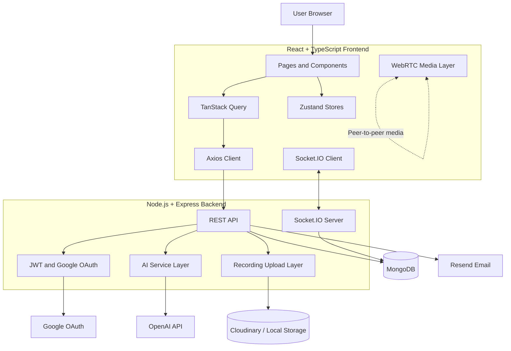

<div align="center">

# IntellMeet

### AI-Powered Meeting & Collaboration Platform

Turn online meetings into organized, collaborative, and actionable workspaces through real-time video, chat, captions, recordings, AI-assisted summaries, action items, task management, and analytics.

[](https://intellmeet-cqas.vercel.app)
[](https://intellmeet-api-5lhs.onrender.com/api/health)
[](https://github.com/Tanishk109/intellmeet/actions/workflows/ci.yml)
[](https://github.com/Tanishk109/intellmeet)


**Developed by [Tanishk Mittal](https://github.com/Tanishk109)**  
**Zidio Development — Web Development Internship Project**

</div>

---

## Table of Contents

- [Overview](#overview)
- [Problem Statement](#problem-statement)
- [Key Features](#key-features)
- [Technology Stack](#technology-stack)
- [System Architecture](#system-architecture)
- [Project Structure](#project-structure)
- [Getting Started](#getting-started)
- [Environment Variables](#environment-variables)
- [Google OAuth Configuration](#google-oauth-configuration)
- [Available Scripts](#available-scripts)
- [API Overview](#api-overview)
- [Testing and CI](#testing-and-ci)
- [Docker and Deployment](#docker-and-deployment)
- [Security Highlights](#security-highlights)
- [Known Limitations](#known-limitations)
- [Future Roadmap](#future-roadmap)
- [Author](#author)

---

## Overview

**IntellMeet** is a full-stack MERN meeting and collaboration platform designed for remote teams, student groups, startups, and project-based organizations.

The platform combines browser-based meetings with collaboration and post-meeting productivity tools. Users can schedule meetings, invite participants, join real-time video rooms, communicate through live chat, share their screens, record sessions, view captions, generate meeting summaries, track action items, manage tasks on a Kanban board, and review meeting analytics.

### Live Application

| Service | URL |
|---|---|
| Frontend | [https://intellmeet-cqas.vercel.app](https://intellmeet-cqas.vercel.app) |
| Backend health check | [https://intellmeet-api-5lhs.onrender.com/api/health](https://intellmeet-api-5lhs.onrender.com/api/health) |
| Source code | [https://github.com/Tanishk109/intellmeet](https://github.com/Tanishk109/intellmeet) |

> The Render free instance may take a short time to wake up after inactivity.

---

## Problem Statement

Important meeting outcomes are often distributed across multiple tools. Video communication, chat, recordings, notes, assigned tasks, and follow-up actions may exist separately, causing information loss and delayed execution.

IntellMeet brings these activities together in one application so that a meeting can move through a complete lifecycle:

1. Schedule and invite participants.
2. Join a real-time meeting.
3. Communicate through video, audio, chat, and captions.
4. Record the meeting and save its transcript.
5. Generate a summary and action items.
6. Track follow-up work through tasks and analytics.

---

## Key Features

### Authentication and User Management

- Email and password registration
- Secure login with JWT access and refresh tokens
- Google OAuth 2.0 authentication
- Password hashing with `bcryptjs`
- Protected frontend routes and backend APIs
- Session restoration through refresh-token rotation
- Basic profile update API

### Meeting Management

- Create and schedule meetings
- Generate unique meeting codes
- Invite participants by email
- View upcoming, active, and completed meetings
- Start, join, update, end, and delete meetings
- Maintain participant and attendee history
- Store meeting transcripts and recording URLs

### Real-Time Meeting Room

- Browser-based camera and microphone access
- Peer-to-peer video communication using WebRTC
- Socket.IO-based WebRTC signalling
- Live participant presence
- Microphone and camera state updates
- Screen sharing
- In-meeting chat with persisted message history
- Typing indicators
- Browser-based live captions
- Meeting recording through the MediaRecorder API

### AI-Assisted Meeting Intelligence

- Generate meeting summaries from transcripts
- Extract key discussion points
- Extract and track action items
- Optional OpenAI integration
- Built-in development fallback when no AI key is configured
- AI chat endpoint for contextual assistance

### Collaboration and Productivity

- Kanban-style task board
- Create, edit, move, and delete tasks
- Real-time task-change events
- Notifications and read status
- Meeting recordings page
- Meeting history
- Analytics dashboard with charts
- CSV export for reporting

### Engineering and Deployment

- Responsive React and Tailwind CSS interface
- Route-level code splitting
- Typed frontend API layer
- Dockerized backend
- GitHub Actions CI pipeline
- API testing with Vitest, Supertest, and MongoDB Memory Server
- Frontend deployment on Vercel
- Backend deployment on Render
- MongoDB Atlas-compatible configuration

---

## Technology Stack

| Layer | Technologies | Purpose |
|---|---|---|
| Frontend | React 19, TypeScript, Vite | Component-based user interface and fast builds |
| Styling | Tailwind CSS 4 | Responsive and reusable UI styling |
| Routing | React Router | Client-side navigation and protected application routes |
| Server state | TanStack Query | API data fetching, caching, and synchronization |
| Client state | Zustand | Authentication, theme, and lightweight global state |
| HTTP client | Axios | Typed REST API communication and token refresh |
| Charts | Recharts | Meeting and productivity analytics |
| Backend | Node.js, Express.js | REST API and application server |
| Database | MongoDB, Mongoose | Persistent storage and data modelling |
| Authentication | JWT, bcryptjs, Google OAuth 2.0 | Secure user authentication |
| Real-time | Socket.IO | Presence, chat, captions, task events, and WebRTC signalling |
| Media | WebRTC, MediaDevices, Screen Capture, MediaRecorder | Video, audio, screen sharing, and recording |
| AI | OpenAI API or development fallback | Summaries, key points, action items, and AI chat |
| File storage | Cloudinary or local storage | Recording upload and delivery |
| Email | Resend or development logging | Meeting invitations |
| Testing | Vitest, Supertest, MongoDB Memory Server | Backend API testing |
| DevOps | Docker, GitHub Actions, Vercel, Render | Build, verification, and deployment |

---

## System Architecture



### Communication Flow

- The React frontend communicates with the Express backend through REST APIs.
- Socket.IO manages presence, chat, captions, task updates, and WebRTC signalling.
- WebRTC carries peer-to-peer audio, video, and screen-sharing media.
- MongoDB stores users, meetings, messages, summaries, tasks, and notifications.
- Optional external integrations provide Google login, AI processing, email delivery, and cloud recording storage.

---

## Project Structure

```text
intellmeet/
├── .github/
│   └── workflows/
│       └── ci.yml
├── client/
│   ├── public/
│   ├── src/
│   │   ├── api/
│   │   ├── components/
│   │   ├── features/
│   │   ├── lib/
│   │   ├── pages/
│   │   ├── stores/
│   │   ├── types/
│   │   ├── App.tsx
│   │   └── main.tsx
│   ├── package.json
│   └── vite.config.ts
├── server/
│   ├── src/
│   │   ├── config/
│   │   ├── controllers/
│   │   ├── middleware/
│   │   ├── models/
│   │   ├── routes/
│   │   ├── sockets/
│   │   ├── utils/
│   │   ├── app.js
│   │   └── index.js
│   ├── tests/
│   ├── .env.example
│   ├── Dockerfile
│   ├── docker-compose.yml
│   └── package.json
├── TESTING.md
└── README.md
```

---

## Getting Started

### Prerequisites

Install the following before running the project:

- Node.js 20 or later
- npm
- MongoDB locally, or a MongoDB Atlas connection
- Git

### 1. Clone the Repository

```bash
git clone https://github.com/Tanishk109/intellmeet.git
cd intellmeet
```

### 2. Configure the Backend

```bash
cd server
cp .env.example .env
```

Update the values inside `server/.env`, then install dependencies:

```bash
npm install
```

### 3. Configure the Frontend

Open another terminal:

```bash
cd client
```

Create a `.env` file:

```env
VITE_API_URL=http://localhost:5000
```

Install dependencies:

```bash
npm install
```

### 4. Start the Backend

From the `server` directory:

```bash
npm run dev
```

The API will run at:

```text
http://localhost:5000
```

Health check:

```text
http://localhost:5000/api/health
```

### 5. Start the Frontend

From the `client` directory:

```bash
npm run dev
```

The frontend will run at:

```text
http://localhost:5173
```

---

## Environment Variables

### Backend: `server/.env`

```env
# Server
PORT=5000
NODE_ENV=development

# Database
MONGO_URI=mongodb://127.0.0.1:27017/intellmeet

# Authentication
JWT_ACCESS_SECRET=replace_with_a_long_random_string
JWT_REFRESH_SECRET=replace_with_another_long_random_string
JWT_ACCESS_EXPIRES=15m
JWT_REFRESH_EXPIRES=7d

# Frontend origin
CLIENT_ORIGIN=http://localhost:5173

# Public backend origin
SERVER_URL=http://localhost:5000

# Optional AI integration
OPENAI_API_KEY=

# Optional email invitations
RESEND_API_KEY=
MAIL_FROM=IntellMeet <onboarding@resend.dev>

# Optional recording storage
CLOUDINARY_CLOUD_NAME=
CLOUDINARY_API_KEY=
CLOUDINARY_API_SECRET=

# Optional Google OAuth
GOOGLE_CLIENT_ID=
GOOGLE_CLIENT_SECRET=
```

### Frontend: `client/.env`

```env
VITE_API_URL=http://localhost:5000
```

> Never commit `.env` files, passwords, JWT secrets, OAuth secrets, database credentials, or API keys.

### Generate Secure JWT Secrets

Run this command twice and use different outputs:

```bash
openssl rand -hex 64
```

---

## Google OAuth Configuration

Create an **OAuth 2.0 Web Application** client in Google Cloud Console.

### Local Development

Authorized JavaScript origin:

```text
http://localhost:5173
```

Authorized redirect URI:

```text
http://localhost:5000/api/auth/google/callback
```

### Production

Authorized JavaScript origin:

```text
https://intellmeet-cqas.vercel.app
```

Authorized redirect URI:

```text
https://intellmeet-api-5lhs.onrender.com/api/auth/google/callback
```

Production backend variables:

```env
CLIENT_ORIGIN=https://intellmeet-cqas.vercel.app
SERVER_URL=https://intellmeet-api-5lhs.onrender.com
```

The redirect URI must match exactly, including the protocol, hostname, path, spelling, and absence of an extra trailing slash.

---

## Available Scripts

### Frontend

Run from `client/`:

| Command | Purpose |
|---|---|
| `npm run dev` | Start the Vite development server |
| `npm run build` | Run TypeScript build and create production assets |
| `npm run typecheck` | Run TypeScript validation |
| `npm run lint` | Run ESLint |
| `npm run format` | Format frontend source files |
| `npm run format:check` | Check formatting |
| `npm run preview` | Preview the production build |

### Backend

Run from `server/`:

| Command | Purpose |
|---|---|
| `npm run dev` | Start the backend server |
| `npm start` | Start the production server |
| `npm test` | Run backend tests once |
| `npm run test:watch` | Run tests in watch mode |
| `npm run test:coverage` | Run tests with coverage |
| `npm run seed` | Seed a local demo database |

### Optional Local Demo Data

The seed script creates:

```text
Email: demo@intellmeet.io
Password: demo1234
```

Run:

```bash
cd server
npm run seed
```

> Warning: the seed script clears users, meetings, and notifications. It refuses to reset a non-local database unless `--force` is explicitly supplied. Do not run it against production unintentionally.

---

## API Overview

All protected routes require:

```http
Authorization: Bearer <access-token>
```

The refresh token is stored in an HTTP-only cookie.

### Authentication

| Method | Endpoint | Description |
|---|---|---|
| `POST` | `/api/auth/signup` | Create an account |
| `POST` | `/api/auth/login` | Sign in |
| `POST` | `/api/auth/refresh` | Rotate tokens and issue a new access token |
| `POST` | `/api/auth/logout` | End the session |
| `GET` | `/api/auth/me` | Get the current user |
| `POST` | `/api/auth/forgot-password` | Request password-reset response |
| `GET` | `/api/auth/google` | Start Google OAuth |
| `GET` | `/api/auth/google/callback` | Complete Google OAuth |

### Meetings

| Method | Endpoint | Description |
|---|---|---|
| `GET` | `/api/meetings` | List accessible meetings |
| `POST` | `/api/meetings` | Create a meeting |
| `GET` | `/api/meetings/:code` | Get a meeting |
| `PUT` | `/api/meetings/:code` | Update a meeting |
| `DELETE` | `/api/meetings/:code` | Delete a meeting |
| `POST` | `/api/meetings/:code/start` | Start a meeting |
| `POST` | `/api/meetings/:code/end` | End a meeting |
| `GET` | `/api/meetings/:code/messages` | Get meeting chat history |
| `PUT` | `/api/meetings/:code/transcript` | Save a transcript |
| `POST` | `/api/meetings/:code/recording` | Upload a recording |
| `GET` | `/api/meetings/recordings` | List recording artifacts |

### AI Intelligence

| Method | Endpoint | Description |
|---|---|---|
| `POST` | `/api/ai/meetings/:code/summary` | Generate a meeting summary |
| `GET` | `/api/ai/meetings/:code/summary` | Retrieve a saved summary |
| `PATCH` | `/api/ai/summaries/:id/action-items/:itemId` | Update an action item |
| `POST` | `/api/ai/chat` | Send a message to the AI assistant |

### Tasks and Collaboration

| Method | Endpoint | Description |
|---|---|---|
| `GET` | `/api/tasks` | List tasks |
| `POST` | `/api/tasks` | Create a task |
| `PUT` | `/api/tasks/:id` | Update a task |
| `PATCH` | `/api/tasks/:id/move` | Move a task between statuses |
| `DELETE` | `/api/tasks/:id` | Delete a task |
| `GET` | `/api/notifications` | List notifications |
| `PATCH` | `/api/notifications/:id/read` | Mark one notification as read |
| `PATCH` | `/api/notifications/read-all` | Mark all notifications as read |
| `GET` | `/api/analytics` | Get meeting analytics |
| `PUT` | `/api/profile` | Update the current profile |

### Health Check

```http
GET /api/health
```

Example response:

```json
{
  "success": true,
  "status": "ok",
  "time": "2026-07-15T14:30:00.000Z"
}
```

---

## Testing and CI

### Run Backend Tests

```bash
cd server
npm test
```

The test suite uses:

- Vitest
- Supertest
- MongoDB Memory Server

### Run Frontend Quality Checks

```bash
cd client
npm run lint
npm run typecheck
npm run build
```

### Continuous Integration

The GitHub Actions workflow runs on pushes and pull requests to `main`.

It performs:

1. Frontend dependency installation
2. ESLint checks
3. TypeScript validation
4. Frontend production build
5. Backend dependency installation
6. Backend API tests

Workflow file:

```text
.github/workflows/ci.yml
```

---

## Docker and Deployment

### Run the Backend with Docker

From the repository root:

```bash
docker build -t intellmeet-api ./server
docker run --env-file ./server/.env -p 5000:5000 intellmeet-api
```

The Docker image:

- Uses Node.js 20 Alpine
- Installs production dependencies only
- Runs as a non-root user
- Exposes port `5000`
- Includes an `/api/health` container health check

### Production Configuration

#### Vercel Frontend

Project root:

```text
client
```

Environment variable:

```env
VITE_API_URL=https://intellmeet-api-5lhs.onrender.com
```

#### Render Backend

Recommended settings:

```text
Language: Docker
Root Directory: server
Dockerfile Path: ./Dockerfile
Health Check Path: /api/health
```

Required production variables:

```env
NODE_ENV=production
PORT=5000
MONGO_URI=<mongodb-atlas-uri>
JWT_ACCESS_SECRET=<secure-random-secret>
JWT_REFRESH_SECRET=<different-secure-random-secret>
CLIENT_ORIGIN=https://intellmeet-cqas.vercel.app
SERVER_URL=https://intellmeet-api-5lhs.onrender.com
```

Optional production integrations:

```env
GOOGLE_CLIENT_ID=
GOOGLE_CLIENT_SECRET=
OPENAI_API_KEY=
RESEND_API_KEY=
MAIL_FROM=
CLOUDINARY_CLOUD_NAME=
CLOUDINARY_API_KEY=
CLOUDINARY_API_SECRET=
```

---

## Security Highlights

- Password hashing with bcrypt
- Short-lived JWT access tokens
- Rotating refresh tokens
- HTTP-only refresh-token cookie
- Secure and `SameSite=None` cookie configuration in production
- Access token stored in memory rather than local storage
- Authentication middleware for protected APIs
- Socket authentication using the access token
- Meeting membership checks before joining rooms
- Helmet security headers
- CORS origin restriction
- Global API rate limiting
- Stricter authentication-route rate limiting
- Request body size limit
- Recording upload middleware
- Non-root Docker runtime user
- Environment-based secret management
- Generic forgot-password response to reduce email enumeration

---

## Known Limitations

This project is a functional internship and portfolio implementation. The following areas require additional work before large-scale enterprise use:

- WebRTC currently uses a peer-to-peer mesh and is best suited to small meeting groups.
- A production TURN server is not configured, so connections may fail on restrictive networks.
- Live captions depend on browser speech-recognition support.
- AI summaries use a development fallback when `OPENAI_API_KEY` is not provided.
- AI accuracy values in fallback output are illustrative and are not benchmark measurements.
- Local recording storage is not persistent on ephemeral cloud instances; Cloudinary is recommended.
- The current board behaves primarily as a user-level workspace rather than a complete organization workspace.
- The forgot-password endpoint currently returns a privacy-safe response but does not complete token-based password reset.
- Notification coverage can be expanded for mentions, reminders, and task assignments.
- Full load, penetration, and cross-browser testing remain future production tasks.

---

## Future Roadmap

- Integrate an SFU such as LiveKit, mediasoup, or Janus
- Add a production TURN server
- Add production speech-to-text with speaker identification
- Improve structured AI action-item extraction
- Add complete password-reset email flow
- Build organization and team workspace models
- Add user-based task assignment and due-date reminders
- Add calendar integration
- Add persistent cloud recording and playback controls
- Add meeting transcript search
- Add host moderation and role-based controls
- Expand automated frontend and end-to-end tests
- Add load testing, security scanning, and observability
- Build a companion mobile application

---

## Author

**Tanishk Mittal**

- GitHub: [@Tanishk109](https://github.com/Tanishk109)
- Repository: [IntellMeet](https://github.com/Tanishk109/intellmeet)
- Live project: [intellmeet-cqas.vercel.app](https://intellmeet-cqas.vercel.app)

This project was developed as part of the **Zidio Development Web Development Internship**.

---

<div align="center">

**IntellMeet — turning every meeting into an actionable, trackable event.**

</div>
